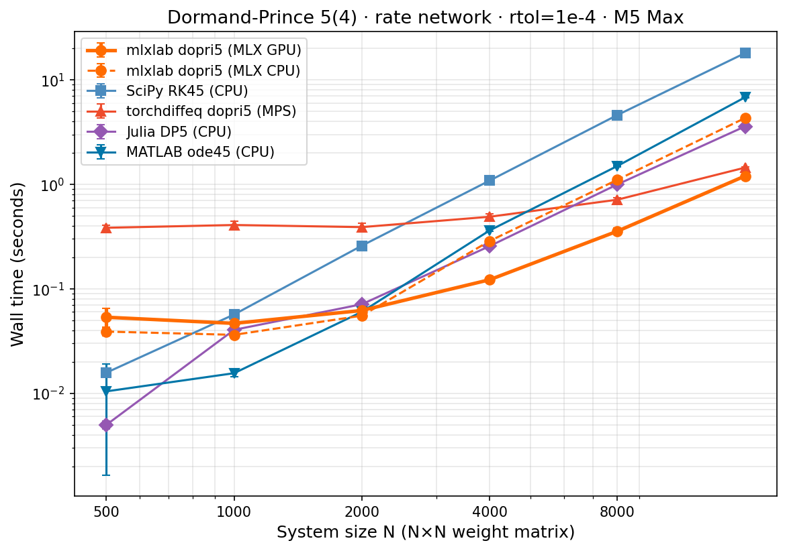
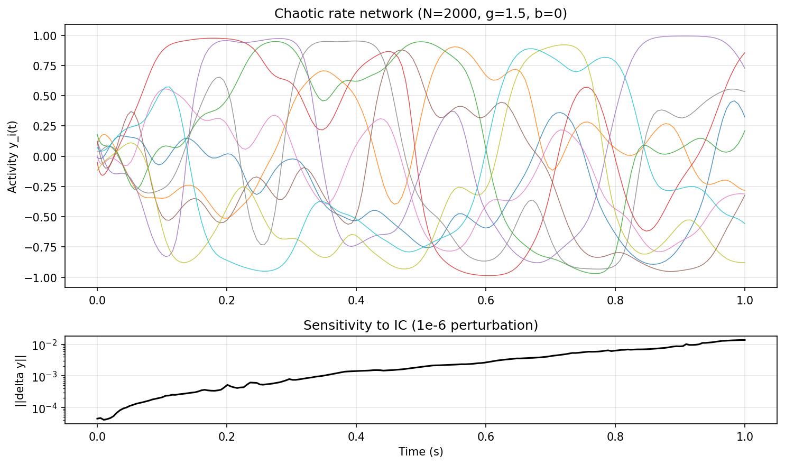

# mlxlab

Scientific computing on Apple Silicon with [MLX](https://github.com/ml-explore/mlx).

## Install

```bash
uv add mlxlab
```

## Status

`mlxlab` is alpha software.

- Best-supported module today: `mlxlab.integrate`
- Target platform: Apple Silicon + MLX
- `mlxlab.linalg` currently relies on MLX 0.31 CPU-only decompositions
- `mlxlab.signal` and `mlxlab.random` are early convenience modules, not full SciPy/NumPy replacements

See [CHANGELOG.md](CHANGELOG.md), [ROADMAP.md](ROADMAP.md), and
[CONTRIBUTING.md](CONTRIBUTING.md) for project status and contribution guidance.

## Quick Start

```python
import mlx.core as mx
import mlxlab as ml

# Define your system: dy/dt = -y
def rhs(y, t):
    return -y

# Solve with adaptive stepping (Tsit5, same family as MATLAB's ode45)
sol = ml.integrate.solve(rhs, mx.array([1.0]), t_span=(0, 5), method="tsit5")

print(sol.y[-1])  # ~ exp(-5) = 0.006738
```

## Why mlxlab?

MLX gives you GPU-accelerated array operations on Apple Silicon. mlxlab builds
scientific computing tools on top -- with ODE/SDE solvers as the flagship
module, plus a small set of linalg, signal, and random utilities that MLX
doesn't ship directly.

```python
# 10,000-neuron rate network -- the W @ r hits the GPU automatically
W = mx.random.normal((10000, 10000)) * 0.01
tau = 0.01

def network_rhs(r, t):
    return (-r + mx.tanh(W @ r)) / tau

sol = ml.integrate.solve(network_rhs, mx.zeros(10000), t_span=(0, 1), dt=0.0001, method="rk4")
```

## Solvers

| Method | Type | Use case |
|--------|------|----------|
| `euler` | Fixed-step | Teaching, quick tests |
| `rk4` | Fixed-step | When you know your dt |
| `tsit5` | Adaptive (default) | General non-stiff ODEs |
| `dopri5` | Adaptive | MATLAB ode45 equivalent |
| `euler_maruyama` | Fixed-step SDE | Stochastic systems |

**Note:** The RHS convention is `f(y, t)` (state first), matching dynamical systems
convention and MLX's array-first style. This differs from SciPy's `f(t, y)`.

## Benchmarks

Dormand-Prince 5(4) adaptive solver across 6 frameworks, same tolerances
(rtol=1e-4, atol=1e-6). Problem: chaotic rate network
`dy/dt = (-y + tanh(W @ y)) / tau` with gain g=1.5, b=0 (above the Sompolinsky
chaos threshold). All frameworks save the full trajectory. Benchmarked on
M5 Max (40 GPU cores, 128 GB).



| N | mlxlab GPU | mlxlab CPU | Julia DP5 | MATLAB ode45 | SciPy RK45 | torchdiffeq MPS |
|---|---|---|---|---|---|---|
| 500 | 0.121s | 0.085s | **0.009s** | 0.016s | 0.034s | 1.361s |
| 1000 | 0.125s | 0.088s | **0.097s** | 0.030s | 0.125s | 1.445s |
| 2000 | **0.123s** | 0.153s | 0.148s | 0.136s | 0.549s | 1.408s |
| 4000 | **0.246s** | 0.682s | 0.665s | 0.857s | 2.262s | 1.504s |
| 8000 | **0.736s** | 2.624s | 2.424s | 3.511s | 9.182s | 2.003s |
| 16000 | **2.842s** | 10.251s | 8.682s | 13.929s | 37.245s | 4.038s |
| 32000 | **10.624s** | 41.012s | 34.497s | 54.881s | -- | 17.052s |

**Key findings:**

- **N >= 2000: mlxlab GPU is fastest.** At N=8000, 3.3x faster than Julia, 4.8x
  faster than MATLAB, 12.5x faster than SciPy.
- **N=32000: mlxlab GPU is 3.3x faster than Julia, 1.6x faster than torchdiffeq.**
- **N < 1000: Julia wins** due to compiled language with zero per-step dispatch
  overhead. mlxlab's ~0.12s floor comes from `mx.eval()` calls in the Python loop.
- **Step counts are consistent** across frameworks: ~140-180 steps for float32
  solvers, ~300-350 for float64 (SciPy/MATLAB), confirming the same algorithm
  is being solved.
- **SciPy and MATLAB use float64 internally** (SciPy upcasts; MATLAB ode45 operates
  in double precision). This is disclosed, not corrected -- it reflects the real-world
  experience of switching frameworks. MATLAB's higher step count (~2x) is a
  consequence of float64 error estimation at the same tolerances.

**Chaos verification:** The system shows chaotic dynamics at all benchmark sizes.
A 1e-6 perturbation to initial conditions amplifies 43x (N=500), 241x (N=1000),
and 306x (N=2000) over T=1s, consistent with positive Lyapunov exponents (though
this is a finite-time sensitivity check, not a rigorous exponent computation).
The finite-size transition is visible at N=500 (weaker chaos) but all sizes show
irregular, non-periodic dynamics.



**Methodology:** Each framework was benchmarked in a separate process, run
sequentially (never in parallel). System load was verified idle (>70% CPU idle) via
`top` between each run. Median of 5 runs (3 for N >= 16000), 1 warmup run. All
benchmarks use seed 42, same gain/tau/tolerances, and save the full trajectory.
Note: the random matrix W differs across languages (NumPy PCG64 vs Julia
MersenneTwister vs MATLAB default) so the specific chaotic trajectory differs,
but the statistical properties (spectral radius, chaos strength) are equivalent.
Scripts are in `benchmarks/`.

## Additional Modules

### mlxlab.linalg

Functions that MLX doesn't ship, built on its CPU-only decompositions (lu, qr, svd):

```python
import mlxlab as ml

ml.linalg.det(A)            # determinant (via SVD + LU)
ml.linalg.slogdet(A)        # sign and log-abs-determinant
ml.linalg.lstsq(A, b)       # minimum-norm least-squares (via pseudoinverse)
ml.linalg.matrix_rank(A)    # numerical rank (via SVD)
ml.linalg.cond(A)           # 2-norm condition number (returns inf for singular)
```

Note: MLX 0.31's decompositions are CPU-only. Results live in unified memory and
can be used in subsequent GPU operations. For operations MLX already provides
(eig, svd, cholesky, solve, inv, etc.), use `mlx.core.linalg` directly.

### mlxlab.signal

FFT-based spectral analysis built on `mlx.core.fft`:

```python
import mlxlab as ml

freqs = ml.signal.fftfreq(n, d=1/fs)
freqs, power = ml.signal.psd(x, fs=1000)
freqs, power = ml.signal.welch(x, fs=1000, nperseg=256)
times, freqs, Sxx = ml.signal.spectrogram(x, fs=1000, nperseg=256)
```

### mlxlab.random

Distributions that MLX doesn't ship, built on `mlx.core.random`:

```python
import mlxlab as ml

ml.random.exponential(shape=(1000,), scale=2.0)
ml.random.gamma(shape_param=5.0, scale=2.0, shape=(1000,))
ml.random.beta(a=2.0, b=5.0, shape=(1000,))
ml.random.poisson(lam=3.0, shape=(1000,))       # returns int32
ml.random.binomial(n=20, p=0.3, shape=(1000,))  # returns int32
```

Supports explicit PRNG keys via `key=` for reproducibility (keys are split
internally to ensure independence across draws).

## Roadmap (v0.2)

- **Compiled integration loop** -- push the time-stepping loop into compiled MLX to
  eliminate per-step Python/`mx.eval()` overhead. This is the main bottleneck at
  small N (the ~0.12s floor) and would extend mlxlab's advantage to smaller systems.
- **Sparse matrices** -- no MLX foundation exists yet; major undertaking.
- **Implicit/stiff solvers** -- BDF, SDIRK methods for stiff systems.
- **Special functions** -- bessel, gamma function (may need custom Metal kernels).
- **Interpolation** -- interp1d, splines.
- **Dense output** -- continuous interpolation between solver steps.
- **GPU linalg** -- when MLX ships GPU decompositions.

## Acknowledgments

Built by [@linattuale](https://github.com/linattuale) with
[Claude Opus 4.6 (1M context)](https://claude.ai/claude-code) for implementation,
benchmarking, and iteration. Code review, correctness auditing, and repo hygiene by
[OpenAI GPT-5.4 Codex](https://chatgpt.com/codex) — whose two thorough review passes
caught critical bugs (PRNG key reuse, singular matrix handling, PSD normalization)
and significantly improved the library's reliability before public release.

## License

MIT
